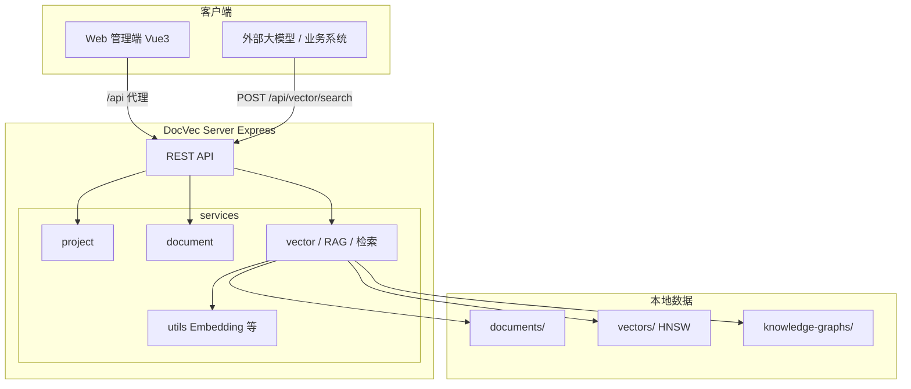

# DocVec

**文档向量化与 RAG 知识库管理平台** — 上传文档、一键训练、混合检索，对外暴露 HTTP API 供大模型与业务系统集成。

<p>
  <strong>关键词</strong>：
  <code>RAG</code> · <code>向量检索</code> · <code>知识图谱</code> · <code>混合检索</code> · <code>HNSW</code> ·
  <code>BGE Embedding</code> · <code>同义词扩展</code> · <code>RRF 融合</code> · <code>重排序</code> ·
  <code>本地部署</code> · <code>知识库</code>
</p>

---

## 目录

- [项目简介](#项目简介)
- [核心能力](#核心能力)
- [技术架构](#技术架构)
- [仓库结构](#仓库结构)
- [环境要求](#环境要求)
- [快速开始](#快速开始)
- [模块说明](#模块说明)
- [对外 API](#对外-api)
- [配置说明](#配置说明)
- [构建与部署](#构建与部署)
- [数据与存储](#数据与存储)
- [文档](#文档)
- [常见问题](#常见问题)
- [许可证](#许可证)

---

## 项目简介

**DocVec**（`docvec-platform`）是一套面向团队与个人的 **文档知识库 + 语义检索** 解决方案。你可以把它理解为：

- **知识库后台**：管理多个「项目」，每个项目下上传一批文档（Markdown、Word、HTML、TXT 等）。
- **RAG 训练流水线**：自动完成文本提取 → 结构化分块 → 中文向量嵌入 → HNSW 索引 → 轻量知识图谱 → 同义词挖掘。
- **混合检索服务**：用户用自然语言提问时，系统在**全库**上做向量 + 图谱 + 同义词多路召回，RRF 融合后经 Embedding 重排序，返回最相关片段。
- **对外集成入口**：通过 `POST /api/vector/search` 将检索结果交给外部大模型（OpenAI、Dify、自研 Agent 等）做生成，**无需**把向量库下载到对方环境。

适合场景：内部文档问答、产品手册检索、技术 Wiki RAG、给第三方提供「托管检索 API」等。

---

## 核心能力

| 能力 | 说明 |
|------|------|
| **多格式文档** | Markdown、TXT、HTML、Word（`.doc` / `.docx`），上传时自动提取纯文本 |
| **Markdown 感知分块** | 按标题层级与滑动窗口切分，保留章节信息 |
| **中文语义向量** | `Xenova/bge-base-zh-v1.5`，检索 query 带 BGE 官方指令前缀 |
| **知识图谱** | 从文档抽取实体/章节关系，支持模糊实体链接与 query 扩展 |
| **同义词挖掘** | 训练时自动从文档 + 图谱挖掘同义词组，支持全局 `synonyms.json` 补充 |
| **混合检索** | 多 query 向量召回 + 图谱结构召回 → RRF 融合 → Bi-Encoder 重排序 |
| **向量库导出** | 打包 `tar.gz`（含索引、分块清单、同义词、可选图谱）便于迁移 |
| **Web 管理界面** | 项目/文档管理、训练进度、检索测试、对外 API 说明与复制 |

---

## 技术架构



| 层级 | 技术选型 |
|------|----------|
| 前端 | Vue 3、Vite、Element Plus、Pinia、Tailwind CSS |
| 后端 | Node.js 20+、Express、TypeScript (ESM) |
| 向量索引 | LangChain HNSWLib + hnswlib-node |
| Embedding | `@xenova/transformers` + BGE 中文模型（ONNX 本地推理） |
| 包管理 | pnpm workspace（`shared` + `server` + `web`） |

---

## 仓库结构

```
doc-verctor/
├── packages/
│   ├── web/                 # 前端管理界面（端口 3000）
│   ├── server/              # 后端 API（端口 3001）
│   │   ├── src/
│   │   │   ├── routes/      # Controller：project / document / vector
│   │   │   ├── services/    # 业务逻辑（按功能拆分）
│   │   │   │   ├── project/
│   │   │   │   ├── document/
│   │   │   │   ├── vector/  # RAG 训练、图谱、检索
│   │   │   │   └── utils/   # Embedding、文本相似度等公共方法
│   │   │   └── utils/       # 存储、分块、打包等基础设施
│   │   ├── data/            # 运行时数据（gitignore）
│   │   └── docs/
│   │       └── SERVER.md    # 服务端详细设计文档
│   └── ...
├── shared/                  # 前后端共享类型与文档格式常量
├── package.json
├── pnpm-workspace.yaml
└── README.md
```

---

## 环境要求

| 依赖 | 版本 |
|------|------|
| **Node.js** | ≥ 20.10 |
| **pnpm** | ≥ 8.0 |
| **tar** | 系统需安装（向量库下载打包用，macOS/Linux 通常自带） |

> 首次训练/检索会从 Hugging Face 拉取 ONNX 模型（BGE 等），请保证网络可达或提前配置镜像。

---

## 快速开始

### 1. 安装依赖

```bash
git clone <your-repo-url> doc-verctor
cd doc-verctor
pnpm install
```

### 2. 启动开发环境（前后端同时）

```bash
pnpm dev
```

| 服务 | 地址 |
|------|------|
| Web 管理端 | http://localhost:3000 |
| API 服务 | http://localhost:3001 |
| 健康检查 | http://localhost:3001/api/health |

开发模式下，Vite 将 `/api` 代理到 `http://localhost:3001`。

### 3. 仅启动某一端

```bash
# 仅后端
pnpm dev:server

# 仅前端（需后端已运行）
pnpm dev:web
```

### 4. 典型使用流程

1. 打开 http://localhost:3000 ，创建项目  
2. 上传文档（支持拖拽、批量）  
3. 进入项目详情 → **向量化** → 配置分块参数 → **开始训练**  
4. 训练完成后在页面测试 **混合检索**，或复制 **语义搜索 API** 给外部系统调用  

---

## 模块说明

### 前端 `packages/web`

| 模块 | 说明 |
|------|------|
| `views/ProjectsView` | 项目列表 |
| `views/ProjectDetailView` | 文档管理、训练、检索测试、API 说明 |
| `stores/project` | 项目与文档状态（Pinia） |
| `api/` | 封装后端 REST 调用 |

### 后端 `packages/server`

按 **Controller** 对应三个业务目录，详见 [SERVER.md](packages/server/docs/SERVER.md)。

| 目录 | 职责 |
|------|------|
| **`services/project`** | 项目 CRUD、删除时清理文档/向量/图谱目录 |
| **`services/document`** | 文档上传、多格式解析、列表与删除 |
| **`services/vector`** | RAG 训练流水线、知识图谱、同义词、混合检索 |
| **`services/vector/retrieval`** | 多 query 召回、RRF、重排序 |
| **`services/utils`** | BGE Embedding、文本模糊匹配、术语抽取（跨模块复用） |
| **`src/utils`** | 文件存储、Markdown 分块、tar 打包等基础设施 |

#### RAG 训练阶段

```
加载文档 → 结构化分块 → 向量嵌入 → HNSW 索引 → 知识图谱 → 同义词挖掘 → 完成
```

#### 混合检索流程

```
用户 query
  → 同义词 / 图谱扩展（多 query）
  → 向量语义召回 + 图谱结构召回
  → RRF 融合
  → Embedding 重排序
  → 返回 topK 文本片段
```

---

## 对外 API

训练完成后，外部系统只需调用检索接口（无需下载向量库）：

```http
POST /api/vector/search
Content-Type: application/json

{
  "projectId": "你的项目 UUID",
  "query": "退款流程是什么？",
  "topK": 5
}
```

响应中的 `results[].content` 可直接拼入大模型 Prompt 作为 RAG 上下文。

项目详情页会展示完整 URL 与 body 示例；也可调用：

```http
GET /api/vector/search-api/:projectId
```

获取当前环境的接口说明。

**主要 API 一览**

| 前缀 | 说明 |
|------|------|
| `GET/POST /api/projects` | 项目管理 |
| `GET/POST/DELETE /api/documents/:projectId` | 文档列表、上传、删除 |
| `POST /api/vector/vectorize/:projectId` | 启动训练 |
| `GET /api/vector/status/:projectId` | 训练进度 |
| `POST /api/vector/search` | **混合检索（对外核心）** |
| `GET /api/vector/download/:projectId` | 下载向量库 tar.gz |

---

## 配置说明

### 检索参数

编辑 `packages/server/src/services/vector/retrieval/config.ts`：

| 配置项 | 默认值 | 说明 |
|--------|--------|------|
| `MAX_SEARCH_QUERIES` | 4 | 多 query 扩展上限 |
| `MAX_RERANK_CANDIDATES` | 15 | 重排序候选数（越小越快） |
| `ENABLE_CROSS_ENCODER` | 见源码 | `false` 时仅用 Embedding 重排，首次搜索更快 |
| `MIN_VECTOR_SCORE` | 0.12 | 向量召回最低相似度 |

### 全局同义词

编辑 `packages/server/data/synonyms.json`：

```json
[
  ["退货", "退款", "退换货"],
  ["图标", "icon", "svg"]
]
```

训练时还会在 `vectors/{projectId}/synonyms.json` 自动生成项目级同义词。

### 环境变量

| 变量 | 默认值 | 说明 |
|------|--------|------|
| `PORT` | `3001` | 后端监听端口 |

---

## 构建与部署

### 生产构建（源码）

```bash
pnpm build
```

- 服务端 TypeScript 输出：`packages/server/dist/index.js`
- 前端静态资源：`packages/web/dist/`

### 分别打包发布（推荐）

前后端独立产出，便于分别部署：

```bash
# 前端 → packages/web/release/web/
pnpm pack:web

# 后端可执行包 → packages/server/release/docvec-server/
pnpm pack:server

# 或一次性
pnpm pack
```

| 命令 | 产物 |
|------|------|
| `pnpm pack:web` | `packages/web/release/web/` 静态文件 + README |
| `pnpm pack:server` | `packages/server/release/docvec-server/` 含 `docvec-server` 可执行文件 |
| `pnpm pack:server:mac` | 仅 macOS arm64 可执行文件 |
| `pnpm pack:server:linux` | 仅 Linux x64 |
| `pnpm pack:server:win` | 仅 Windows x64 |

**后端 pkg 发布包结构：**

```
release/docvec-server/
├── docvec-server      # 可执行主程序（pkg）
├── start.sh / start.bat
├── data/              # 运行时数据（可写）
├── node_modules/      # hnswlib、transformers、onnxruntime 等（勿删）
└── README.txt
```

运行（macOS / Linux）：

```bash
cd packages/server/release/docvec-server
./start.sh
# 默认 PORT=3001，数据目录为 ./data
```

环境变量（可选）：

| 变量 | 说明 |
|------|------|
| `DOCVEC_APP_ROOT` | 应用根目录（默认：可执行文件所在目录） |
| `DOCVEC_DATA_DIR` | 数据目录（默认：`$DOCVEC_APP_ROOT/data`） |
| `PORT` | 监听端口，默认 `3001` |

首次安装依赖若提示 `Ignored build scripts`，在项目根执行：

```bash
pnpm approve-builds --all && pnpm install
```

### 运行生产后端（Node 方式，非 pkg）

```bash
cd packages/server
pnpm build
node dist/index.js
# 或单文件 bundle
pnpm build:bundle && pnpm start:bundle
```

### 部署前端静态资源

将 `packages/web/release/web`（或 `packages/web/dist`）交由 Nginx / Caddy 等托管，并反向代理 API：

```nginx
# 示例：Nginx
server {
    listen 80;
    server_name docvec.example.com;

    root /var/www/docvec/web/dist;
    index index.html;

    location / {
        try_files $uri $uri/ /index.html;
    }

    location /api/ {
        proxy_pass http://127.0.0.1:3001;
        proxy_http_version 1.1;
        proxy_set_header Host $host;
        proxy_set_header X-Real-IP $remote_addr;
        client_max_body_size 50m;
    }
}
```

### 部署检查清单

- [ ] Node.js ≥ 20，已安装 `pnpm` 与系统 `tar`
- [ ] `packages/server/data` 目录可写（项目、文档、向量、图谱）
- [ ] 首次启动需下载 Embedding 模型，预留磁盘与网络
- [ ] 生产环境建议：HTTPS、API 鉴权、按 `projectId` 限流
- [ ] 更新文档后需 **重新训练**；更换 Embedding 模型后必须全量重训

### 使用进程管理（可选）

```bash
# 示例：PM2
cd packages/server
pnpm build
pm2 start dist/index.js --name docvec-api
```

---

## 数据与存储

运行时数据位于 `packages/server/data/`（已在 `.gitignore` 中忽略）：

```
data/
├── projects.json
├── synonyms.json              # 全局同义词（可选）
├── documents/{projectId}/     # 原始文件 + documents.json
├── vectors/{projectId}/       # HNSW 索引、docstore、synonyms.json
└── knowledge-graphs/{projectId}.json
```

备份时复制整个 `data/` 目录即可；迁移后需保证 Node 版本与 Embedding 模型一致。

---

## 文档

| 文档 | 说明 |
|------|------|
| [packages/server/docs/SERVER.md](packages/server/docs/SERVER.md) | 服务端架构、RAG 流水线、混合检索、API 与模块详解 |
| 本文档（README.md） | 项目概览、运行与部署 |

---

## 常见问题

**Q：首次搜索很慢？**  
A：首次会下载并加载 BGE Embedding 模型。将 `ENABLE_CROSS_ENCODER` 设为 `false` 可避免加载额外重排模型。

**Q：用户说的词和文档用词不一致搜不到？**  
A：已支持同义词扩展 + 图谱模糊匹配 + 多 query。可在 `synonyms.json` 或重新训练后的项目同义词中补充业务词对。

**Q：能否只把向量库给别人用？**  
A：可以下载 tar.gz，但对方需对齐同一 Embedding 与索引格式。更推荐对外暴露 `POST /api/vector/search` 做托管检索。

**Q：支持 PDF 吗？**  
A：当前版本不支持 PDF、CSV、JSON，仅 Markdown / TXT / HTML / Word。

---

## 许可证

本项目为私有仓库（`private: true`）。若需开源，请根据实际情况补充 LICENSE 文件。

---

<p align="center">
  <sub>DocVec — 让文档知识库可训练、可检索、可集成</sub>
</p>
