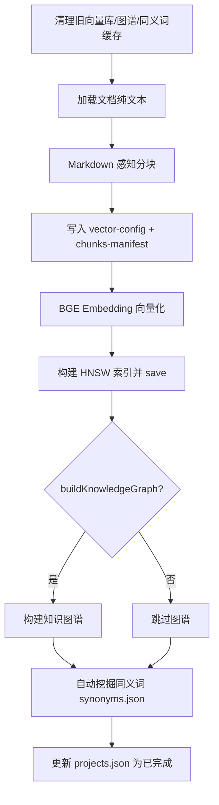
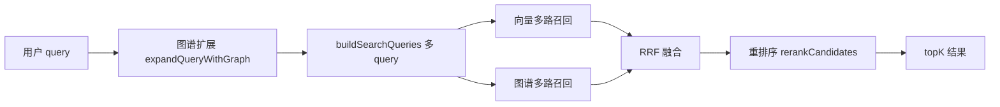
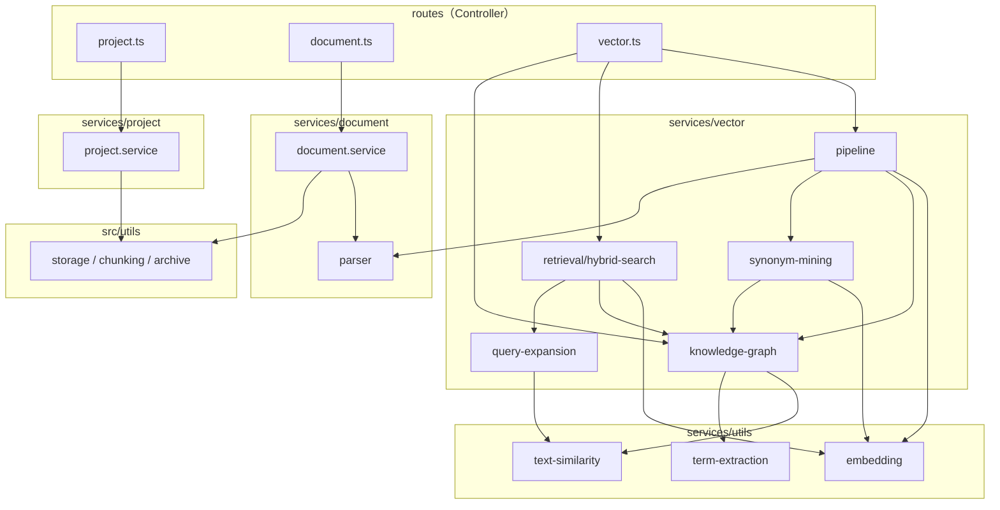

# DocVec 服务端逻辑说明

本文档描述 `packages/server` 的架构、数据流与核心模块，便于维护与二次开发。

---

## 1. 总体架构

DocVec 服务端是一个基于 **Express** 的 REST API，负责：

- 项目管理与文档上传
- **RAG 知识库训练**（分块 → 向量化 → HNSW 索引 → 知识图谱 → 同义词挖掘）
- **混合检索**（向量 + 图谱 + 同义词扩展 + RRF 融合 + 重排序）
- 向量库打包下载

技术栈：

| 组件 | 选型 |
|------|------|
| 运行时 | Node.js + TypeScript (ESM) |
| Web 框架 | Express 4 |
| 向量索引 | LangChain HNSWLib + hnswlib-node |
| Embedding | `@xenova/transformers` + `Xenova/bge-base-zh-v1.5` |
| 重排序（可选） | Cross-Encoder `Xenova/ms-marco-MiniLM-L-6-v2` 或 Bi-Encoder 回退 |
| 共享类型 | `@docvec/shared` monorepo 包 |

### 1.1 目录结构

按 **Controller（路由）** 拆分为三个业务目录，公共能力放在 `services/utils`：

```
packages/server/src/
├── index.ts                 # 应用入口、路由挂载、全局错误处理
├── routes/                  # Controller 层（薄，调用 services）
│   ├── project.ts           # → services/project
│   ├── document.ts          # → services/document
│   └── vector.ts            # → services/vector
├── services/
│   ├── utils/               # 跨模块公共方法
│   │   ├── embedding.ts     # BGE Embedding + HNSW
│   │   ├── text-similarity.ts
│   │   ├── term-extraction.ts
│   │   └── index.ts
│   ├── project/             # 项目业务
│   │   ├── project.service.ts
│   │   └── index.ts
│   ├── document/            # 文档业务
│   │   ├── parser.ts        # 多格式解析
│   │   ├── document.service.ts
│   │   └── index.ts
│   └── vector/              # 向量化 / RAG / 检索
│       ├── pipeline.ts      # RAG 训练流水线
│       ├── knowledge-graph.ts
│       ├── query-expansion.ts
│       ├── synonym-mining.ts
│       ├── hybrid-retrieval.ts  # 兼容导出
│       ├── retrieval/       # 混合检索子模块
│       │   ├── config.ts
│       │   ├── hybrid-search.ts
│       │   ├── vector-retriever.ts
│       │   ├── graph-retriever.ts
│       │   ├── rrf.ts
│       │   ├── reranker.ts
│       │   └── index.ts
│       └── index.ts
└── utils/                   # 基础设施（存储、分块、打包等）
    ├── storage.ts
    ├── rag-chunking.ts
    ├── chunking.ts
    ├── chunk-store.ts
    ├── archive.ts
    ├── content-disposition.ts
    └── api-base.ts
```

### 1.2 数据存储布局

所有数据落在 `packages/server/data/`：

```
data/
├── projects.json                          # 项目列表元数据
├── synonyms.json                          # 全局同义词补充（可选）
├── documents/{projectId}/                 # 原始文档 + sidecar 文本
│   ├── documents.json                     # 文档元数据列表
│   ├── {uuid}-{filename}                  # 原始文件
│   └── {uuid}.extracted.txt               # Word 等提取的纯文本
├── vectors/{projectId}/                   # 向量库（可下载）
│   ├── docstore.json                      # LangChain 文档块存储
│   ├── args.json                          # HNSW 参数
│   ├── vector-config.json                 # 分块配置
│   ├── chunks-manifest.json               # 分块清单（无正文）
│   └── synonyms.json                      # 项目自动挖掘的同义词组
└── knowledge-graphs/{projectId}.json      # 项目知识图谱
```

---

## 2. API 路由

### 2.1 健康检查

| 方法 | 路径 | 说明 |
|------|------|------|
| GET | `/api/health` | 服务存活探测 |

### 2.2 项目 `/api/projects`

| 方法 | 路径 | 说明 |
|------|------|------|
| GET | `/` | 项目列表 |
| GET | `/:id` | 单个项目详情 |
| POST | `/` | 创建项目（创建 `documents/{id}` 目录） |
| PUT | `/:id` | 更新名称/描述 |
| DELETE | `/:id` | 删除项目及关联文档目录、向量库、图谱 |

**业务实现**：`routes/project.ts` → `services/project/project.service.ts`。

项目实体字段见 `@docvec/shared` 的 `Project`：`vectorized`、`knowledgeGraphBuilt`、`documentCount`、`status` 等。

### 2.3 文档 `/api/documents`

| 方法 | 路径 | 说明 |
|------|------|------|
| GET | `/:projectId` | 文档列表 |
| POST | `/:projectId/upload` | 多文件上传（Multer，单文件 ≤50MB） |
| DELETE | `/:projectId/:documentId` | 删除文档 |

**业务实现**：`routes/document.ts` → `services/document/document.service.ts` + `services/document/parser.ts`。

**支持格式**（`@docvec/shared` 定义）：Markdown、TXT、HTML、Word（`.doc`/`.docx`）。

**上传流程**：

1. 校验扩展名 → 写入 `documents/{projectId}/`
2. 非纯文本格式调用 `ensureExtractedText` 生成 `.extracted.txt` sidecar
3. 更新 `documents.json` 与 `projects.json` 中的 `documentCount`

### 2.4 向量 / RAG `/api/vector`

**业务实现**：`routes/vector.ts` → `services/vector/`（训练、检索、下载等）。

| 方法 | 路径 | 说明 |
|------|------|------|
| GET | `/search-api/:projectId` | 返回对外检索 API 说明（URL、body 示例） |
| GET | `/status/:projectId` | 训练进度或已完成状态 |
| POST | `/vectorize/:projectId` | 启动异步 RAG 训练 |
| POST | `/search` | **混合检索**（核心对外接口） |
| GET | `/download/:projectId` | 下载向量库 tar.gz |

#### POST `/api/vector/search` 请求体

```json
{
  "projectId": "uuid",
  "query": "用户自然语言问题",
  "topK": 5
}
```

#### 响应字段（节选）

```json
{
  "success": true,
  "data": {
    "results": [
      {
        "documentId": "...",
        "filename": "README.md",
        "section": "特性",
        "content": "片段正文...",
        "score": 0.82,
        "source": "both",
        "chunkIndex": 1
      }
    ],
    "query": "原问题",
    "projectId": "...",
    "expandedQuery": "原问题 扩展词...",
    "graphTerms": ["扩展词1"],
    "searchQueries": ["query1", "query2"],
    "hybridSearch": true,
    "reranked": true,
    "candidateCount": 15
  }
}
```

`source` 取值：`vector` | `graph` | `both`。

---

## 3. RAG 训练流水线

入口：`POST /api/vector/vectorize/:projectId` → `runRagPipeline()`（`services/vector/pipeline.ts`）。

训练为 **异步**：接口立即返回 `VectorizeStatus`，后台执行流水线；前端轮询 `/status/:projectId`。

### 3.1 流程图



### 3.2 各阶段说明

| 阶段 | stage | 说明 |
|------|-------|------|
| 加载 | `loading` | `readDocumentText` 读取 TXT/MD/HTML 或 sidecar |
| 分块 | `chunking` | `buildRagChunks`：按标题层级 + 字符窗口切分 |
| 嵌入 | `embedding` | `createEmbeddings` + `embedDocuments` |
| 索引 | `indexing` | `createVectorStore` → HNSWLib → 保存到 `vectors/{id}/` |
| 图谱 | `knowledge_graph` | `buildKnowledgeGraphFromChunks` |
| 同义词 | `knowledge_graph`（进度 92%） | `buildSynonymGroupsFromProject` |
| 完成 | `completed` | 写回项目状态 |

**默认分块参数**：`chunkSize=800`，`chunkOverlap=100`（可在请求体覆盖）。

**训练请求体可选字段**：

```json
{
  "chunkSize": 800,
  "chunkOverlap": 100,
  "buildKnowledgeGraph": true
}
```

---

## 4. 核心服务模块

### 4.1 Embedding（`services/utils/embedding.ts`）

- 模型：`Xenova/bge-base-zh-v1.5`（768 维，中文检索）
- **Query** 侧自动加 BGE 官方前缀：`为这个句子生成表示以用于检索相关文章：`
- **文档块** 不加前缀
- 单例 `createEmbeddings()`，避免重复加载 ONNX 模型
- `createVectorStore` / `loadVectorStore`：对接 LangChain HNSWLib

### 4.2 文档解析（`services/document/parser.ts`）

| 类型 | 处理方式 |
|------|----------|
| `.md` / `.txt` | 直接读 UTF-8 |
| `.html` | 剥离 script/style/标签 |
| `.docx` | mammoth 提取纯文本 |
| `.doc` | word-extractor |

二进制格式上传时生成 `{base}.extracted.txt`，训练时优先读 sidecar。

### 4.3 分块（`utils/rag-chunking.ts`）

- 识别 Markdown 标题作为 `section`
- 在 section 内按 `chunkSize` / `chunkOverlap` 滑动窗口切分
- 输出 `RagChunk`：`content` + `metadata`（documentId、filename、chunkIndex、section）

### 4.4 知识图谱（`services/vector/knowledge-graph.ts`）

**构建规则**（从每个 chunk）：

- 节点类型：`document` → `section` → `entity` / `concept`
- 边：`contains`、`mentions`、`related_to`（同 chunk 实体共现）、`describes`
- 实体来源：`term-extraction.ts` 从加粗、代码、链接等模式抽取

**检索相关能力**：

| 函数 | 作用 |
|------|------|
| `matchGraphNodes` | 模糊匹配 query 与节点 label（编辑距离 + 二元组 Jaccard） |
| `expandQueryWithGraph` | 命中种子节点 → 沿边扩散 → 返回扩展词列表 |
| `searchKnowledgeGraph` | 结构召回：实体/章节/文档 → 映射到 docstore 中的文本块 |

### 4.5 同义词（`services/vector/query-expansion.ts` + `synonym-mining.ts`）

**三层来源**（合并为 Map，带缓存）：

1. 内置通用同义词组（退货/退款等）
2. `data/synonyms.json` 全局补充
3. `vectors/{projectId}/synonyms.json` 训练时自动生成

**自动挖掘**（`buildSynonymGroupsFromProject`）：

- 从 chunks + 图谱收集候选词（≤120）
- 图谱 `related_to` 边 + 字面模糊配对 + Embedding 相似度聚类（并查集合并）
- 训练结束写入 `synonyms.json`

**多 query 生成**（`buildSearchQueries`）：

- 原问 + 同义词组合 + 图谱扩展词 + 拆词及其同义词
- 默认最多 **4** 条 query（见 `RETRIEVAL_CONFIG`）

### 4.6 混合检索（`services/vector/retrieval/`）

主入口：`hybridSearch()`。



#### 4.6.1 向量召回（`vector-retriever.ts`）

- 对每条 `searchQuery` 调用 `vectorStore.similaritySearchWithScore`
- 余弦距离转相似度：`cosineDistanceToSimilarity`
- 过滤 `score < MIN_VECTOR_SCORE`（默认 0.12）
- 同 chunk 多 query 命中时 **RRF 分数累加**

#### 4.6.2 图谱召回（`graph-retriever.ts`）

- 对 `[原 query, ...graphTerms]` 最多 4 条 query 调用 `searchKnowledgeGraph`
- 多列表 RRF 合并

#### 4.6.3 RRF 融合（`rrf.ts`）

公式：\( \text{score}(d) += \frac{1}{k + \text{rank}} \)，`k = RRF_K`（默认 60）。

- `mergeRankedListsWithRrf`：单路多 query 合并
- `fuseVectorAndGraph`：向量 + 图谱双路合并，双路命中标 `source: both`

#### 4.6.4 重排序（`reranker.ts`）

| 模式 | 条件 | 说明 |
|------|------|------|
| **Bi-Encoder**（默认） | `ENABLE_RERANK=true` | 复用 BGE：批量 `embedQuery` + `embedDocuments`，余弦相似度重排 |
| **Cross-Encoder**（可选） | `ENABLE_CROSS_ENCODER=true` | 加载 `Xenova/ms-marco-MiniLM-L-6-v2`，逐对打分；失败则回退 Bi-Encoder |

重排候选数：`min(topK × 3, 15)`（见 `config.ts`）。

> **性能建议**：首次搜索慢主要因 Embedding 模型首次下载。若不需 Cross-Encoder，请保持 `ENABLE_CROSS_ENCODER: false`，避免二次下载大模型。

#### 4.6.5 配置项（`retrieval/config.ts`）

```typescript
RETRIEVAL_CONFIG = {
  RRF_K: 60,
  MIN_VECTOR_SCORE: 0.12,
  MAX_SEARCH_QUERIES: 4,
  CANDIDATE_MULTIPLIER: 4,
  MAX_CANDIDATES_PER_ROUTE: 24,
  RERANK_CANDIDATE_MULTIPLIER: 3,
  MAX_RERANK_CANDIDATES: 15,
  ENABLE_RERANK: true,
  ENABLE_CROSS_ENCODER: true,   // 代码当前值；若求首次搜索更快可改为 false
  RERANKER_MODEL: 'Xenova/ms-marco-MiniLM-L-6-v2',
  RERANK_PASSAGE_MAX_CHARS: 384,
}
```

### 4.7 向量库下载（`vector.ts` + `archive.ts`）

1. 复制 `vectors/{projectId}/` 下全部文件到临时目录
2. 若存在 `knowledge-graphs/{projectId}.json`，复制为 `knowledge-graph.json`
3. `tar -czf` 打包，通过 `Content-Disposition` 返回（支持中文文件名 RFC 5987）

---

## 5. 模块职责摘要

### 5.1 `services/utils`（跨业务公共）

| 模块 | 职责 |
|------|------|
| `embedding.ts` | BGE 单例、`createVectorStore` / `loadVectorStore` |
| `text-similarity.ts` | `extractQueryTerms`、`fuzzyMatchScore`、编辑距离、二元组 Jaccard |
| `term-extraction.ts` | 从 Markdown 加粗/代码/链接等抽实体 |
| `index.ts` | 统一导出 |

### 5.2 `src/utils`（基础设施）

| 模块 | 职责 |
|------|------|
| `storage.ts` | 路径常量、`readJsonFile` / `writeJsonFile`、目录初始化 |
| `rag-chunking.ts` | Markdown 感知分块 |
| `chunk-store.ts` | 解析 `docstore.json` 为 `StoredChunk[]` |
| `chunking.ts` | `cosineDistanceToSimilarity` 等 |
| `api-base.ts` | 对外 API base URL |
| `content-disposition.ts` | 下载文件名 Header |
| `archive.ts` | `tar.gz` 打包 |

---

## 6. 运行时与依赖关系



- **内存**：Embedding 模型常驻单例；Cross-Encoder 仅在启用时懒加载
- **并发**：训练按项目串在内存 Map `vectorizeProgress`；多项目同时训练会共享同一 Embedding 实例
- **持久化**：无数据库，全部 JSON + 文件系统

---

## 7. 对外集成建议

1. **外部大模型 / 业务系统** 只需调用 `POST /api/vector/search`，无需下载向量库
2. 将返回的 `results[].content` 拼入 Prompt 做 RAG 生成
3. 生产环境建议：HTTPS、API Key、按 `projectId` 鉴权、限流
4. 更新文档后需 **重新训练**；更换 Embedding 模型后必须全量重训

---

## 8. 本地开发

```bash
#  monorepo 根目录
pnpm dev

# 仅服务端
cd packages/server && pnpm dev
```

默认端口：`3001`（可通过环境变量 `PORT` 覆盖）。

---

## 9. 版本与流水线标识

- RAG 流水线标识：`rag-v1`（写入 `vector-config.json`）
- 混合检索模块：`packages/server/src/services/vector/retrieval/`

文档随代码更新，如有行为差异以源码为准。
